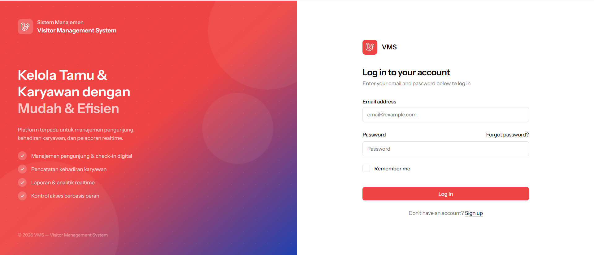
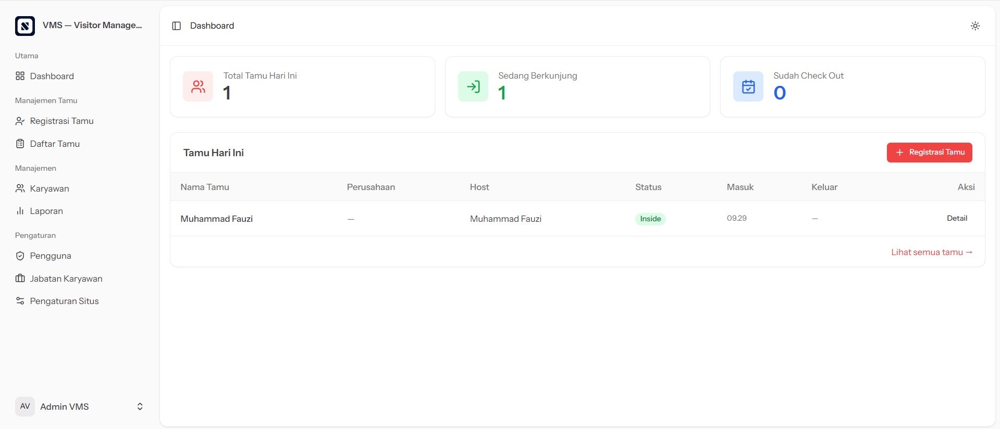
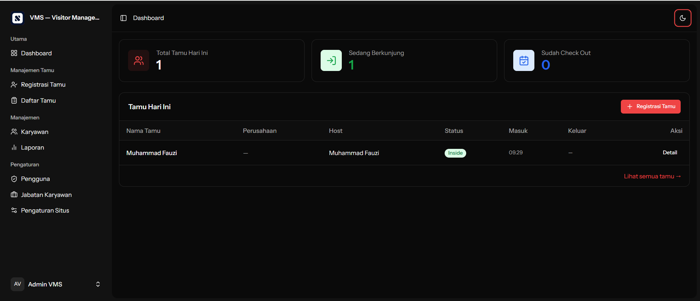
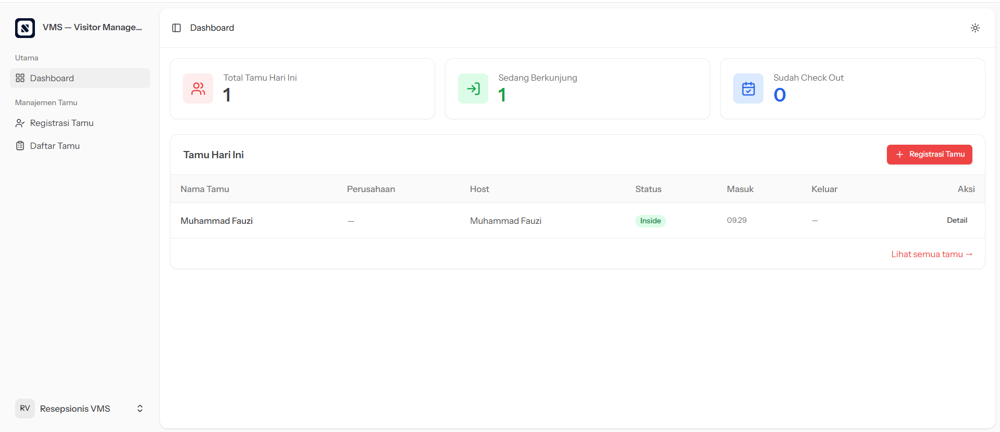
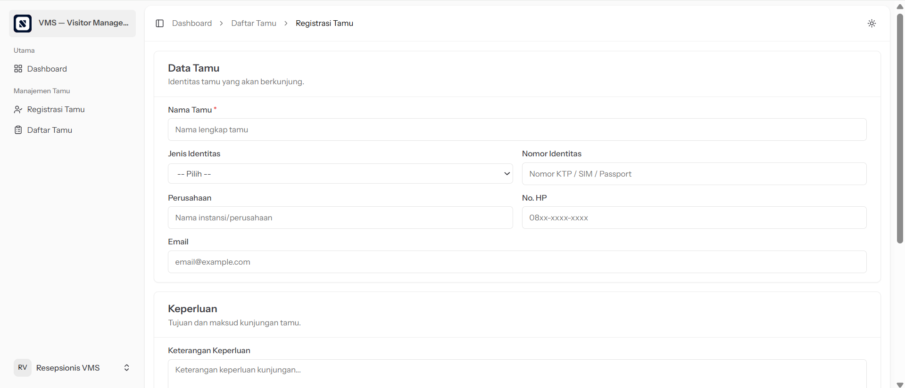

<p align="center">
  
</p>

<p align="center">
  <em>Built with ❤️ by <a href="https://softwaremaju.com">Softwaremaju</a></em>
</p>

---

# VMS — Visitor Management System

> Sistem manajemen pengunjung berbasis web untuk pencatatan dan monitoring tamu yang datang ke kantor atau perusahaan secara real-time.

<p align="center">
  
</p>

## Tentang Aplikasi

VMS (Visitor Management System) adalah aplikasi open source yang dirancang untuk membantu perusahaan atau kantor dalam mengelola kunjungan tamu secara digital. Dari registrasi tamu, proses check-in & check-out, hingga pelaporan — semuanya tercatat rapi dan dapat dipantau secara real-time.

---

## Fitur Utama

### Dashboard Real-Time
- Ringkasan tamu hari ini: total tamu, sedang berkunjung, dan sudah check-out
- Tabel daftar tamu hari ini beserta status dan waktu masuk

### Manajemen Tamu
- **Registrasi Tamu** — Formulir lengkap mencakup nama, jenis identitas (KTP/SIM/Paspor), nomor identitas, asal perusahaan, nomor HP, email, keperluan kunjungan, nomor kendaraan, nomor badge, dan pilihan host/karyawan yang dituju
- **Daftar Tamu** — Pencarian dan filter tamu berdasarkan nama/perusahaan, host, tanggal, dan status kunjungan
- **Detail Tamu** — Informasi lengkap per tamu berikut riwayat kunjungan
- **Check-In & Check-Out** — Proses pencatatan masuk dan keluar tamu dengan timestamp otomatis

### Manajemen Karyawan
- Data karyawan lengkap (NIK, nama, departemen, jabatan, email, nomor HP)
- Filter karyawan berdasarkan departemen dan status aktif
- Import data karyawan massal via file Excel/CSV
- Export data karyawan ke Excel

### Laporan Kunjungan
- Filter laporan berdasarkan rentang tanggal dan status kunjungan
- Export laporan ke file Excel

### Manajemen Pengguna & Akses

- Manajemen akun pengguna dengan tiga tingkat peran
- Kontrol akses berbasis peran:
  - **Admin** — Akses penuh ke seluruh fitur (tamu, karyawan, laporan, pengguna, pengaturan)
  - **Resepsionis** — Manajemen tamu: registrasi, check-in, check-out, dan daftar tamu
  - **Host (Karyawan)** — Portal pribadi untuk melihat dan mendaftarkan tamu yang berkunjung khusus ke dirinya, serta membatalkan undangan tamu yang belum check-in

### Jabatan Karyawan
- Kelola daftar jabatan/posisi karyawan

### Pengaturan Situs
- Kustomisasi nama aplikasi, warna utama (primary color), dan logo

### Tampilan
- Mode gelap (Dark Mode) dan mode terang (Light Mode)

---

## Screenshots

<table>
  <tr>
    <td align="center"><strong>Dashboard (Light Mode)</strong></td>
    <td align="center"><strong>Dashboard (Dark Mode)</strong></td>
  </tr>
  <tr>
    <td></td>
    <td></td>
  </tr>
  <tr>
    <td align="center"><strong>Tampilan Resepsionis</strong></td>
    <td align="center"><strong>Registrasi Tamu</strong></td>
  </tr>
  <tr>
    <td></td>
    <td></td>
  </tr>
</table>

---

## Cara Setup (Step by Step)

### Persyaratan Sistem

- PHP >= 8.2
- Composer
- Node.js >= 18 & NPM
- Database: MySQL / MariaDB / SQLite

---

### Langkah Instalasi

**1. Clone Repository**

```bash
git clone https://github.com/username/vms-sistem.git
cd vms-sistem
```

**2. Install Dependency PHP**

```bash
composer install
```

**3. Salin File Konfigurasi**

```bash
cp .env.example .env
```

**4. Generate Application Key**

```bash
php artisan key:generate
```

**5. Konfigurasi Database**

Buka file `.env` dan sesuaikan koneksi database:

```env
DB_CONNECTION=mysql
DB_HOST=127.0.0.1
DB_PORT=3306
DB_DATABASE=vms_db
DB_USERNAME=root
DB_PASSWORD=
```

> Untuk SQLite, cukup gunakan `DB_CONNECTION=sqlite` dan buat file `database/database.sqlite`.

**6. Jalankan Migrasi & Seeder**

```bash
php artisan migrate --seed
```

**7. Buat Symbolic Link Storage**

```bash
php artisan storage:link
```

**8. Install Dependency Frontend**

```bash
npm install
```

**9. Build Asset Frontend**

Untuk development (dengan hot reload):
```bash
npm run dev
```

Untuk production:
```bash
npm run build
```

**10. Jalankan Aplikasi**

```bash
php artisan serve
```

Akses aplikasi di: `http://localhost:8000`

---

### Akun Default

Setelah menjalankan seeder, akun berikut tersedia:

| Role        | Email                       | Password   |
|-------------|-----------------------------|------------|
| Admin       | admin@vms.test              | password   |
| Resepsionis | resepsionis@vms.test        | password   |

> **Penting:** Segera ganti password default setelah login pertama.

---

### Menjalankan Semua Sekaligus (Development)

```bash
composer run dev
```

Perintah ini menjalankan server Laravel, queue listener, dan Vite secara bersamaan.

---

## Lisensi

Proyek ini menggunakan lisensi [MIT](LICENSE).

---

## Donasi

Jika aplikasi ini bermanfaat dan ingin mendukung pengembangan lebih lanjut, Anda dapat berdonasi melalui:

[](https://saweria.co/softwaremaju)

**https://saweria.co/softwaremaju**

---

<p align="center">
  Made with ❤️ by <a href="https://softwaremaju.com">Softwaremaju</a>
</p>
